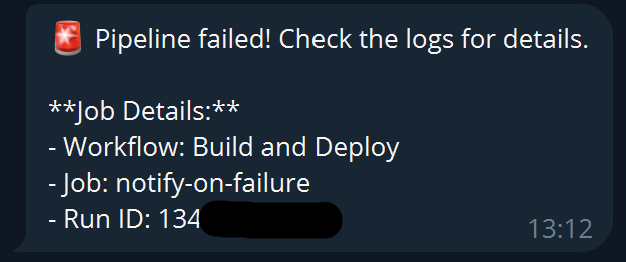
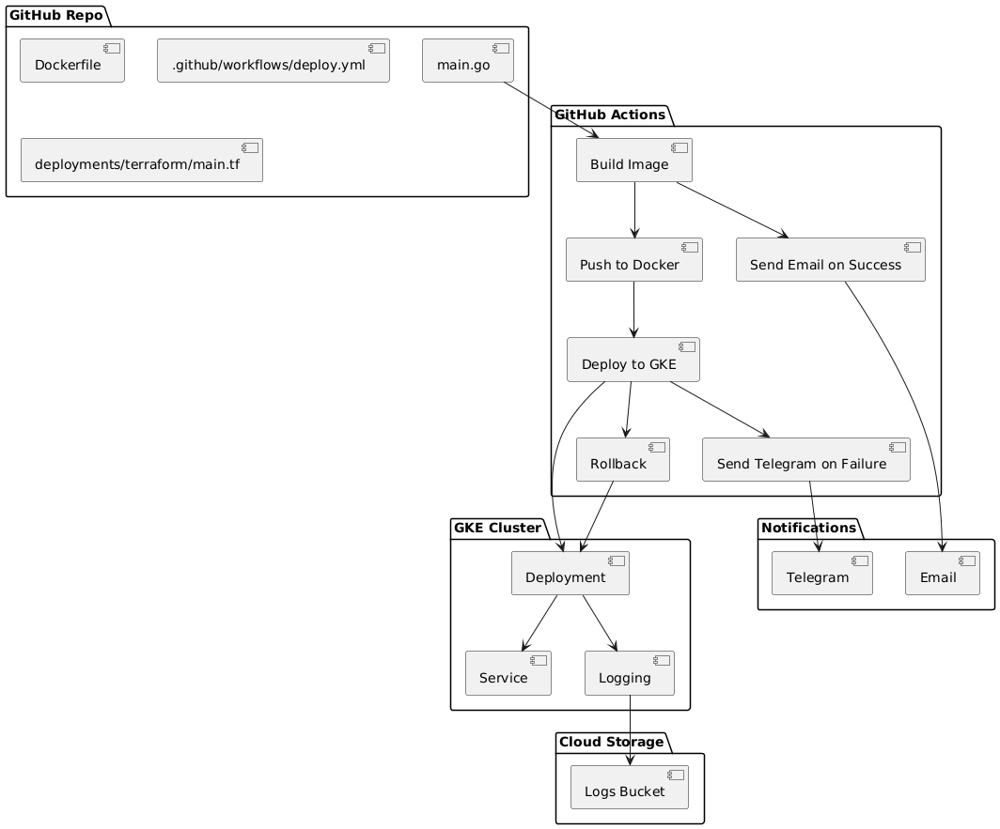

Hello App

Это пример Go-приложения, которое развертывается в Google Kubernetes Engine (GKE) с использованием Terraform, Docker и CI/CD через GitHub Actions. Проект включает централизованное логирование, управление версиями, автоматическое увеличение версии Docker-образа, уведомления по email при успешной сборке и уведомления в Telegram при ошибке.

Используемые инструменты:

Terraform

Google Cloud SDK

Docker

Git

Основные функции

CI/CD: GitHub Actions автоматически собирает Docker-образ, публикует его в Docker Hub и развертывает в GKE.

Уведомления:

Email при успешной сборке.

Telegram при ошибке с логами ошибки.

Централизованное логирование: Логи из GKE экспортируются в Cloud Storage.

Итог

Этот проект демонстрирует современный подход к CI/CD с использованием Terraform, Docker, GKE и GitHub Actions. Он включает уведомления и централизованное логирование, что делает процесс разработки и эксплуатации более удобным и безопасным.
